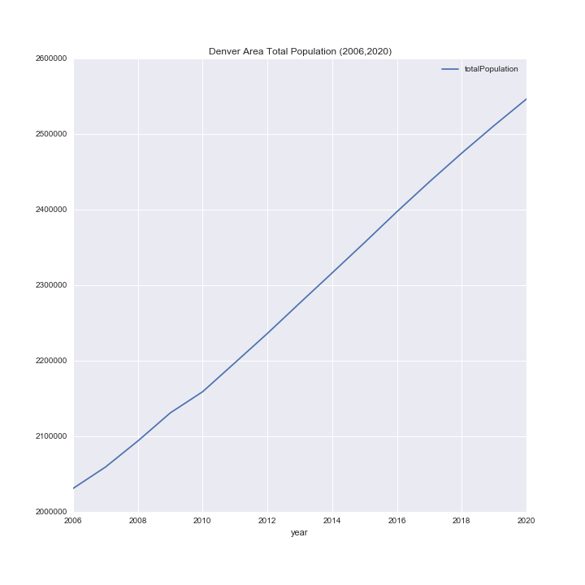

# Introduction

This repository is the results of a miniproject I undertook in order to better understand Colorado's population trends. I also took the opportunity to better understand how to use plotly.

# Data

The population data has been provided by Colorado's state government and can be downloaded from [here](https://data.colorado.gov/Demographics/Colorado-Population-Projections/q5vp-adf3). The website that provides the geojson files with county geolocation data is [CivicDashboards](http://catalog.civicdashboards.com), and the specific colorado county geolocation dataset can be downloaded from [here](http://catalog.civicdashboards.com/dataset/colorado-counties-polygon).

# Colorado's Total Population

# Colorado's Changing Population density

# Denver County Population

# Are People moving here for pot?

I also wanted to see if there was any noticeable trends in the population from the legalization of recreational marijuana. If this is the case I would expect to see a significant increase in the population growth after 2014. Therefore I looked at the population specifically in the years 2006-2020

I also wanted to look at Denver and the surrounding counties to see if I could see anything there.

From these two plots there doesn't seem to be much evidance that recreational marijuana is driving a significant increase in the population. Although it's important to note that 2016-2020 are projected population, so the trend may just not have been picked up yet or accounted for in the projections.
